# WAV2CLIP

Ho-Hsiang Wu, Prem Seetharaman, Kundan Kumar, Juan Pablo Bello

## Abstract

We propose Wav2CLIP, a robust audio representation learning method by distilling from Contrastive Language-Image Pre-training (CLIP). We systematically evaluate Wav2CLIP on a variety of audio tasks including classification, retrieval, and generation, and show that Wav2CLIP can outperform several publicly available pre-trained audio representation algorithms. Wav2CLIP projects audio into a shared embedding space with images and text, which enables multimodal applications such as zero-shot classification, and cross-modal retrieval. Furthermore, Wav2CLIP needs just ~10% of the data to achieve competitive performance on downstream tasks compared with fully supervised models, and is more efficient to pre-train than competing methods as it does not require learning a visual model in concert with an auditory model. Finally, we demonstrate image generation from Wav2CLIP as qualitative assessment of the shared embedding space. Our code and model weights are open sourced and made available for further applications.

## VQGAN-CLIP Generate Samples

### ESC-50

FrogFrogFrogFrog

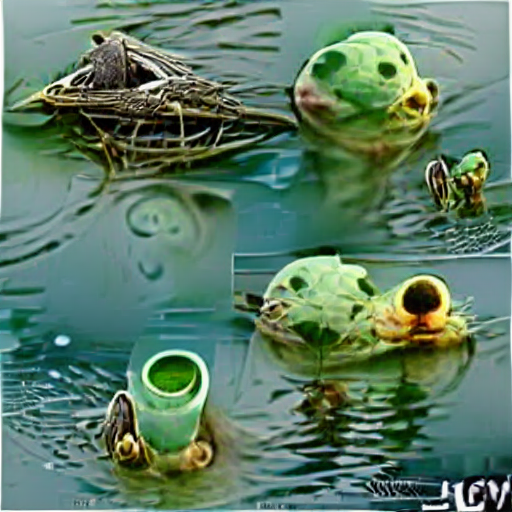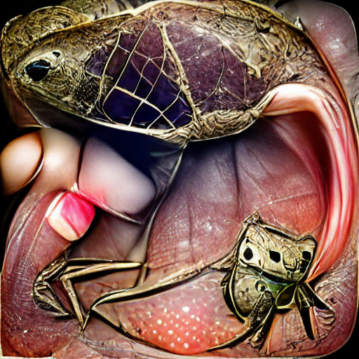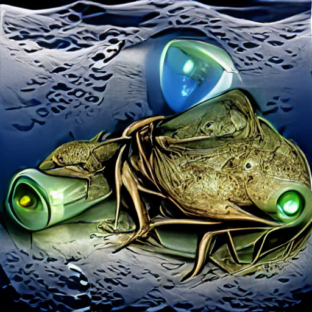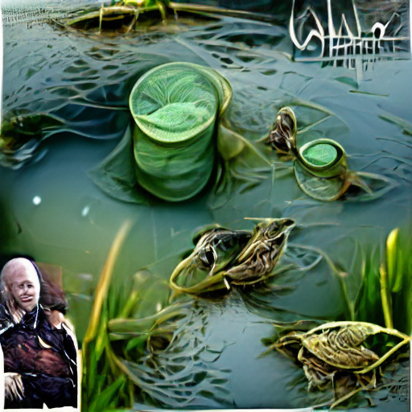

<audio controls style="width: 200px;" src="artifacts/esc50/1-18755-A-4.wav"></audio><audio controls style="width: 200px;" src="artifacts/esc50/1-15689-B-4.wav"></audio><audio controls style="width: 200px;" src="artifacts/esc50/2-32515-B-4.wav"></audio><audio controls style="width: 200px;" src="artifacts/esc50/1-31836-B-4.wav"></audio>

Church_bellsChurch_bellsChurch_bellsChurch_bells

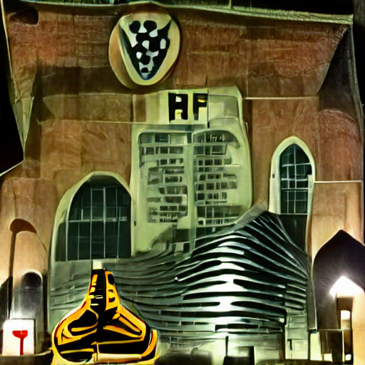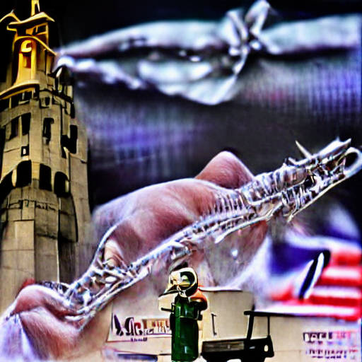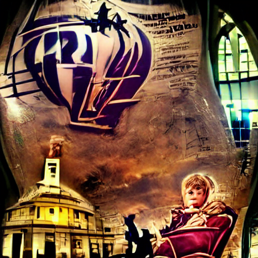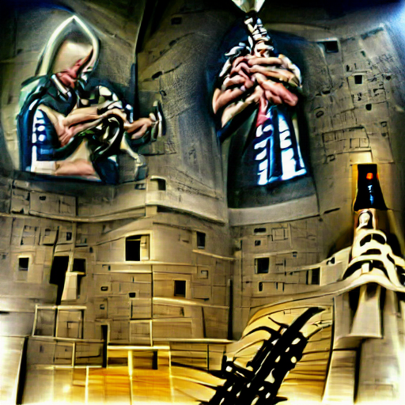

<audio controls style="width: 200px;" src="artifacts/esc50/5-219044-A-46.wav"></audio><audio controls style="width: 200px;" src="artifacts/esc50/1-13572-A-46.wav"></audio><audio controls style="width: 200px;" src="artifacts/esc50/3-139109-A-46.wav"></audio><audio controls style="width: 200px;" src="artifacts/esc50/2-77346-A-46.wav"></audio>

FireworksFireworksFireworksFireworks

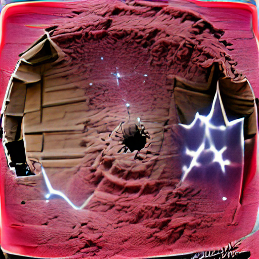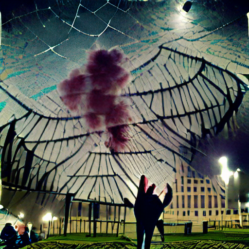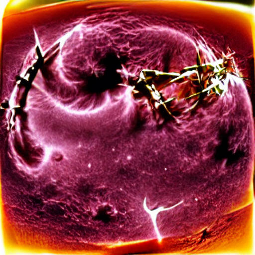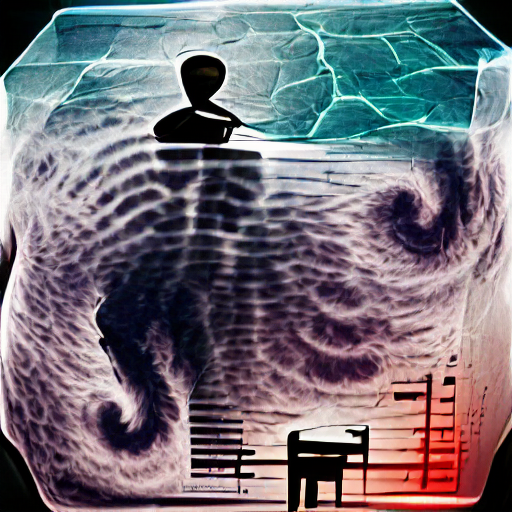

<audio controls style="width: 200px;" src="artifacts/esc50/1-115545-B-48.wav"></audio><audio controls style="width: 200px;" src="artifacts/esc50/5-160614-C-48.wav"></audio><audio controls style="width: 200px;" src="artifacts/esc50/1-115545-A-48.wav"></audio><audio controls style="width: 200px;" src="artifacts/esc50/1-115546-A-48.wav"></audio>

Chirping_birdsCrowWindClock_alarm

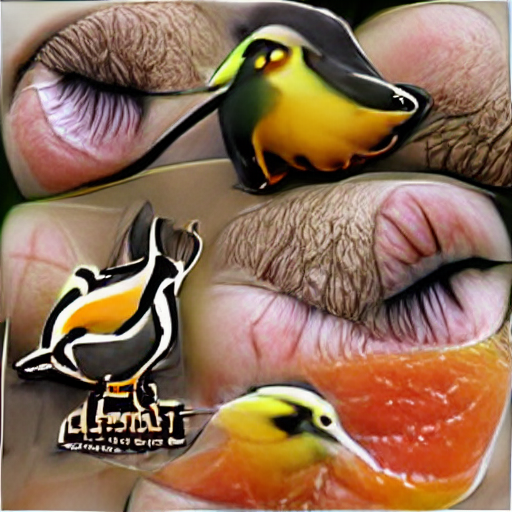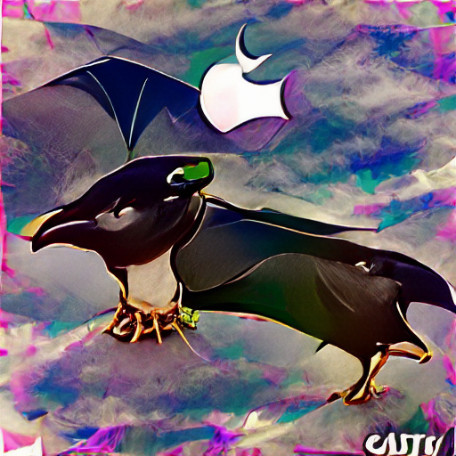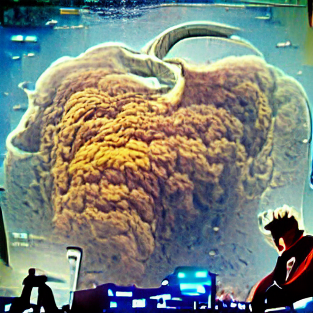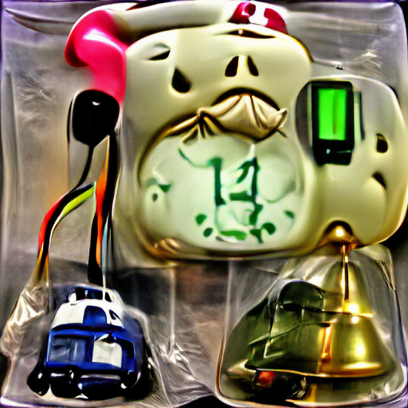

<audio controls style="width: 200px;" src="artifacts/esc50/1-34495-A-14.wav"></audio><audio controls style="width: 200px;" src="artifacts/esc50/1-39835-B-9.wav"></audio><audio controls style="width: 200px;" src="artifacts/esc50/2-109374-A-16.wav"></audio><audio controls style="width: 200px;" src="artifacts/esc50/1-96890-A-37.wav"></audio>

CricketsSheepInsectsAirplane

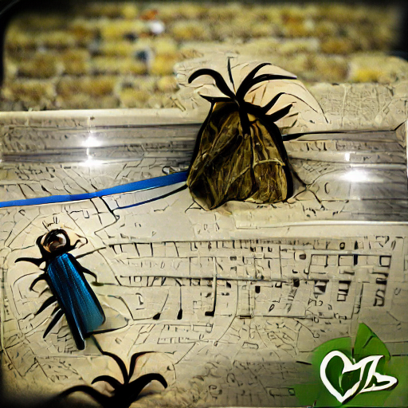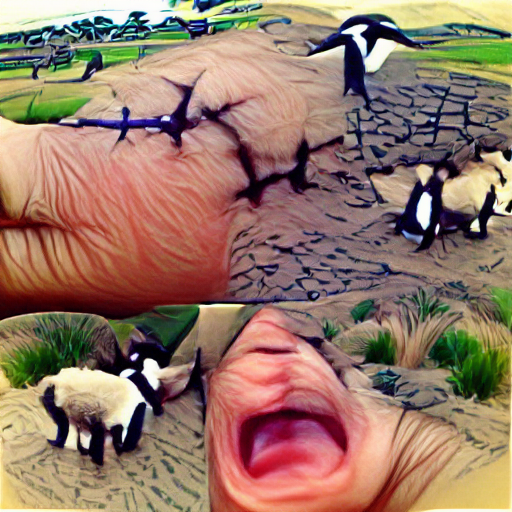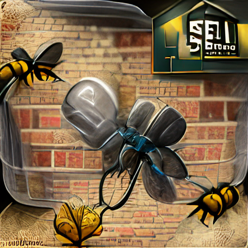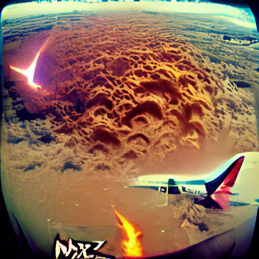

<audio controls style="width: 200px;" src="artifacts/esc50/2-96033-A-13.wav"></audio><audio controls style="width: 200px;" src="artifacts/esc50/1-49409-A-8.wav"></audio><audio controls style="width: 200px;" src="artifacts/esc50/1-73585-A-7.wav"></audio><audio controls style="width: 200px;" src="artifacts/esc50/2-74361-A-47.wav"></audio>

SirenCar_hornDogCrying_baby

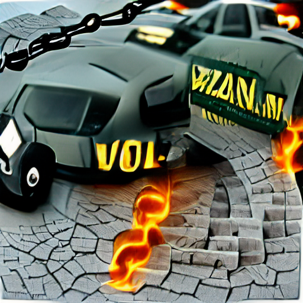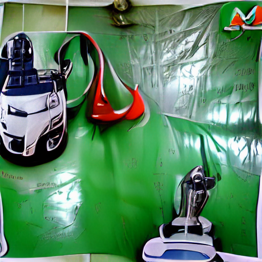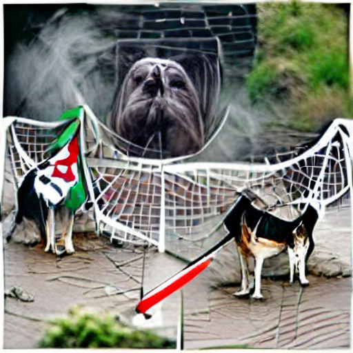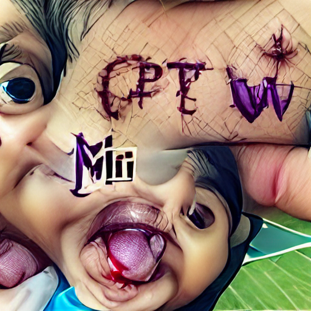

<audio controls style="width: 200px;" src="artifacts/esc50/2-43806-A-42.wav"></audio><audio controls style="width: 200px;" src="artifacts/esc50/2-54086-A-43.wav"></audio><audio controls style="width: 200px;" src="artifacts/esc50/2-116400-A-0.wav"></audio><audio controls style="width: 200px;" src="artifacts/esc50/1-22694-A-20.wav"></audio>

## UMAP Visualizations of Various Audio Classification Tasks

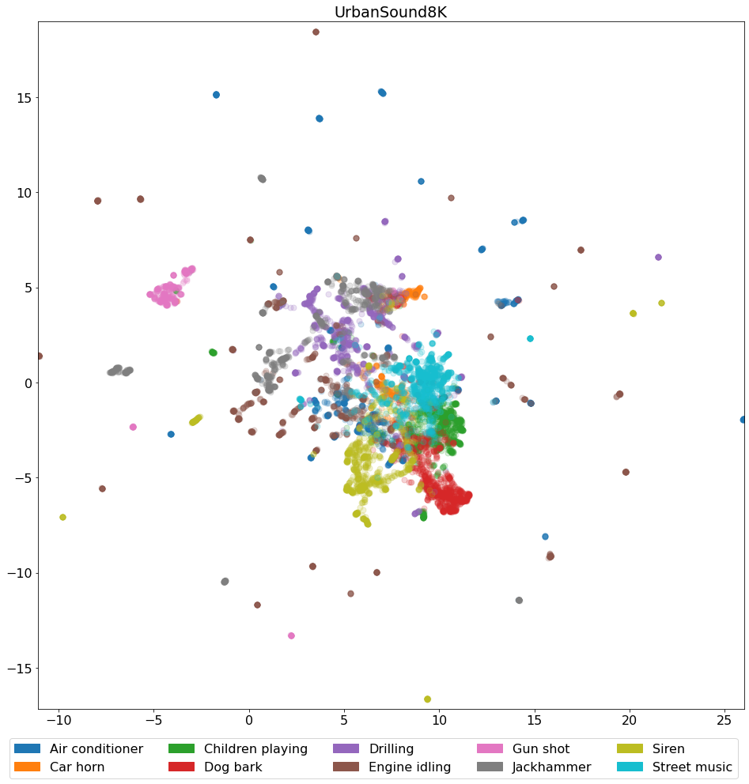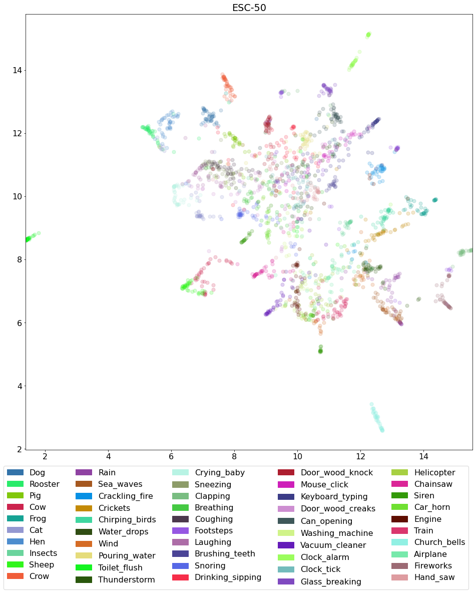

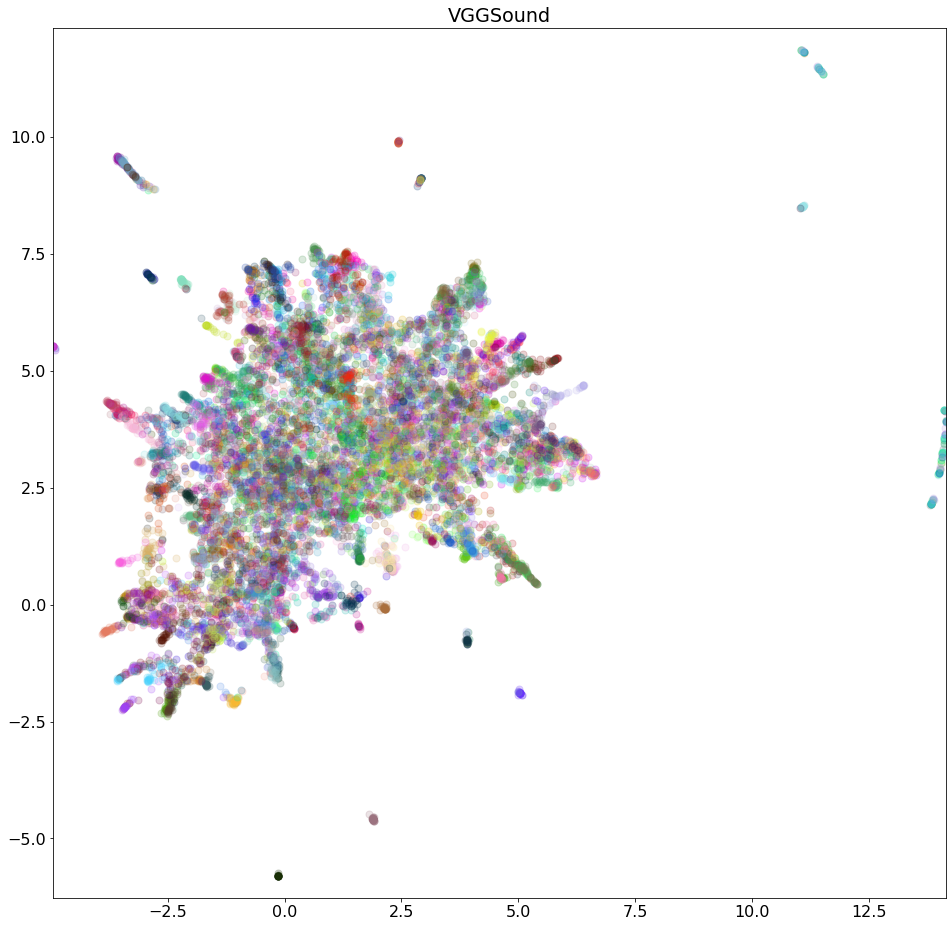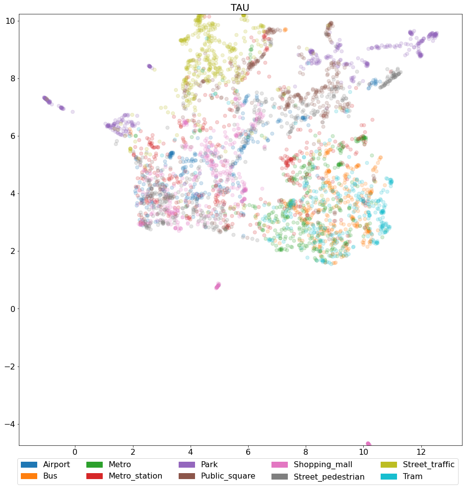

